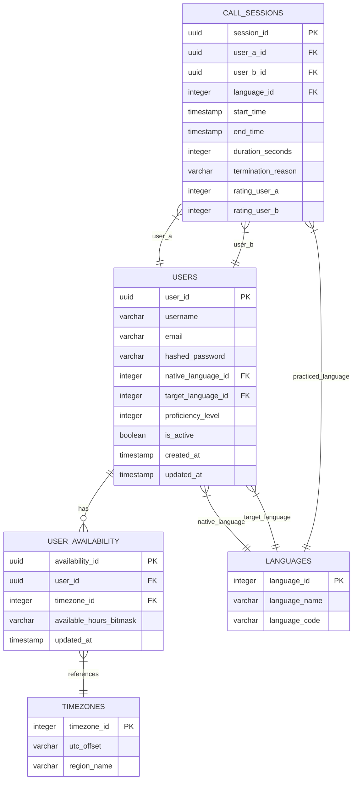

# Database Schema Specification

This document details both the centralized cloud database schema (**PostgreSQL on AWS RDS**) and the local client database schema (**SQLite on Flutter**).

---

## 1. Centralized Cloud Database (PostgreSQL)

### 1.1 Entity Relationship Diagram (ERD)



---

### 1.2 Data Dictionary & Table Definitions (PostgreSQL DDL)

```sql
-- Extension for UUID generation
CREATE EXTENSION IF NOT EXISTS "uuid-ossp";

-- Table: Languages
CREATE TABLE languages (
    language_id SERIAL PRIMARY KEY,
    language_name VARCHAR(50) NOT NULL UNIQUE,
    language_code VARCHAR(10) NOT NULL UNIQUE
);

-- Table: Timezones
CREATE TABLE timezones (
    timezone_id SERIAL PRIMARY KEY,
    utc_offset VARCHAR(10) NOT NULL,
    region_name VARCHAR(100) NOT NULL UNIQUE
);

-- Table: Users
CREATE TABLE users (
    user_id UUID PRIMARY KEY DEFAULT uuid_generate_v4(),
    username VARCHAR(50) NOT NULL UNIQUE,
    email VARCHAR(100) NOT NULL UNIQUE,
    hashed_password VARCHAR(255) NOT NULL,
    native_language_id INTEGER REFERENCES languages(language_id) ON DELETE SET NULL,
    target_language_id INTEGER REFERENCES languages(language_id) ON DELETE SET NULL,
    proficiency_level INTEGER CHECK (proficiency_level BETWEEN 1 AND 5) DEFAULT 1,
    is_active BOOLEAN DEFAULT TRUE,
    created_at TIMESTAMP WITH TIME ZONE DEFAULT CURRENT_TIMESTAMP,
    updated_at TIMESTAMP WITH TIME ZONE DEFAULT CURRENT_TIMESTAMP
);

-- Table: User_Availability
CREATE TABLE user_availability (
    availability_id UUID PRIMARY KEY DEFAULT uuid_generate_v4(),
    user_id UUID NOT NULL REFERENCES users(user_id) ON DELETE CASCADE,
    timezone_id INTEGER REFERENCES timezones(timezone_id),
    available_hours_bitmask VARCHAR(24) NOT NULL DEFAULT '111111111111111111111111',
    updated_at TIMESTAMP WITH TIME ZONE DEFAULT CURRENT_TIMESTAMP,
    CONSTRAINT unique_user_availability UNIQUE (user_id)
);

-- Table: Call_Sessions
CREATE TABLE call_sessions (
    session_id UUID PRIMARY KEY DEFAULT uuid_generate_v4(),
    user_a_id UUID NOT NULL REFERENCES users(user_id),
    user_b_id UUID NOT NULL REFERENCES users(user_id),
    language_id INTEGER REFERENCES languages(language_id),
    start_time TIMESTAMP WITH TIME ZONE NOT NULL,
    end_time TIMESTAMP WITH TIME ZONE,
    duration_seconds INTEGER DEFAULT 0,
    termination_reason VARCHAR(50) DEFAULT 'NORMAL',
    rating_user_a INTEGER CHECK (rating_user_a BETWEEN 1 AND 5),
    rating_user_b INTEGER CHECK (rating_user_b BETWEEN 1 AND 5)
);

-- Indexes for fast matchmaking & lookups
CREATE INDEX idx_users_matching ON users(native_language_id, target_language_id, is_active);
CREATE INDEX idx_call_sessions_users ON call_sessions(user_a_id, user_b_id);
```

---

## 2. Local Client Database (SQLite on Flutter)

Used for instant offline startup, offline session log reviews, and personal vocabulary storage.

```sql
-- Table: local_auth_profile
CREATE TABLE local_auth_profile (
    user_id TEXT PRIMARY KEY,
    username TEXT NOT NULL,
    email TEXT NOT NULL,
    token TEXT NOT NULL,
    native_lang_id INTEGER,
    native_lang_name TEXT,
    target_lang_id INTEGER,
    target_lang_name TEXT,
    proficiency_level INTEGER,
    last_synced_at TEXT
);

-- Table: local_call_history
CREATE TABLE local_call_history (
    session_id TEXT PRIMARY KEY,
    partner_username TEXT NOT NULL,
    language_practiced TEXT NOT NULL,
    started_at TEXT NOT NULL,
    duration_seconds INTEGER NOT NULL,
    notes TEXT
);

-- Table: local_vocabulary
CREATE TABLE local_vocabulary (
    vocab_id INTEGER PRIMARY KEY AUTOINCREMENT,
    session_id TEXT,
    word_or_phrase TEXT NOT NULL,
    translation TEXT NOT NULL,
    notes TEXT,
    created_at TEXT NOT NULL
);
```
