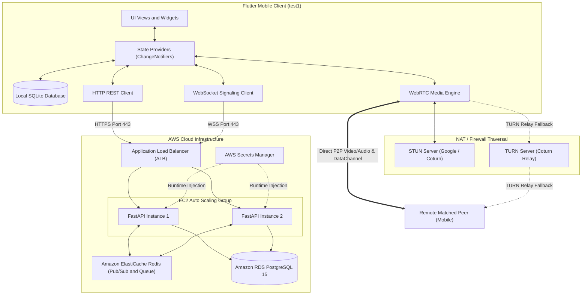

# Complete System Design & Directory Structure Blueprint

This document details the end-to-end software architecture and complete directory blueprint for the **Language Partner Matcher** project, covering the Flutter mobile client (`test1`), the FastAPI backend service (`backend`), and the AWS cloud deployment.

---

## 1. System Architecture Overview

The system combines **Client-Server** control flows (Authentication, Matchmaking, and WebSockets Signaling) with **Direct Peer-to-Peer (P2P)** media streams via WebRTC:



---

## 2. Flutter Client Architecture (`test1`)

The mobile application utilizes the **Clean MVVM / Layered Architecture**:

```text
               ┌────────────────────────────────────────┐
               │    UI Layer (Views & Widgets)          │
               │  - Login / Register / Profile Setup    │
               │  - Animated Matchmaking Radar          │
               │  - Fullscreen Video Call (PiP Preview) │
               │  - In-Call Chat & Conversation Prompts │
               │  - Call History & Saved Vocabulary     │
               └──────────────────▲─────────────────────┘
                                  │ Watches & Triggers
               ┌──────────────────▼─────────────────────┐
               │ State Layer (ChangeNotifier Providers) │
               │  - AuthProvider (JWT & User Profile)   │
               │  - MatchProvider (Queue status & timer)│
               │  - CallProvider (WebRTC Session State) │
               └──────────▲──────────────────▲──────────┘
                          │                  │
       ┌──────────────────▼────────┐   ┌─────▼──────────────────────────┐
       │ Services Layer            │   │ Data Layer                     │
       │ - WebRTCService           │   │ - DatabaseHelper (Local SQLite)│
       │   (RTCPeerConnection,     │   │ - ApiClient (HTTP REST)        │
       │    Audio Routing,         │   │ - Repositories                 │
       │    RTCDataChannel)        │   │   (Auth, Match, History)       │
       │ - WebSocketService        │   └────────────────────────────────┘
       │   (Real-time Signaling)   │
       └───────────────────────────┘
```

### Layer Responsibilities:

| Layer | Responsibility | Key Files |
| :--- | :--- | :--- |
| **UI Layer** | Renders Material 3 interface, captures user gestures, handles animations and video surface bindings. | `lib/views/`, `lib/widgets/` |
| **State Layer** | Manages reactive state via `Provider` / `ChangeNotifier`, handling business rules and asynchronous loading states. | `lib/providers/` |
| **Services Layer** | Controls hardware APIs (`flutter_webrtc`, audio focus, camera) and manages real-time WebSocket signaling sockets. | `lib/services/` |
| **Data Layer** | Interfaces with local SQLite cache (`sqflite`), persistent device storage, and remote REST endpoints via `ApiClient`. | `lib/data/` |
| **Models Layer** | Strongly typed data entities with JSON serialization and SQLite mapping. | `lib/models/` |

---

## 3. Comprehensive Directory Blueprint

```text
test1.0/
│
├── docs/                                  # Global Master Documentation Center
│   ├── README.md                          # Master documentation index
│   ├── project_context.md                 # Academic scope & requirements
│   ├── system_design.md                   # Global architecture specification
│   ├── aws_implementation_step_by_step_guide.md # AWS deployment guide (ASG, ALB, RDS, Secrets)
│   ├── database_schema.md                 # PostgreSQL cloud DDL & SQLite mobile schema
│   ├── webrtc_signaling_protocol.md       # WebSocket signaling protocol & DataChannel format
│   ├── matchmaking_algorithm.md           # Matchmaking math, time-decay & Redis Lua queue
│   └── directory_structure_and_architecture.md # This blueprint document
│
├── backend/                               # Python FastAPI Cloud Backend Service
│   ├── app/
│   │   ├── __init__.py
│   │   ├── main.py                        # FastAPI entrypoint, CORS, and middleware
│   │   ├── core/                          # Security, Configuration, and Database session
│   │   │   ├── __init__.py
│   │   │   ├── config.py                  # Pydantic Settings & environment secrets loader
│   │   │   ├── security.py                # Password hashing (bcrypt) & JWT token handling
│   │   │   └── database.py                # SQLAlchemy engine & async sessionmaker
│   │   ├── models/                        # SQLAlchemy Database Models
│   │   │   ├── __init__.py
│   │   │   ├── user.py                    # Users table definition
│   │   │   ├── language.py                # Languages table definition
│   │   │   ├── timezone.py                # Timezones & User_Availability definitions
│   │   │   └── call_session.py            # Call_Sessions table definition
│   │   ├── schemas/                       # Pydantic Request & Response Models
│   │   │   ├── __init__.py
│   │   │   ├── auth.py                    # Login, Register, Token schemas
│   │   │   ├── user.py                    # User Profile & Preference schemas
│   │   │   └── match.py                   # Match Queue Request & Result schemas
│   │   ├── api/                           # REST API Endpoints
│   │   │   ├── __init__.py
│   │   │   ├── v1/
│   │   │   │   ├── __init__.py
│   │   │   │   ├── auth.py                # /api/v1/auth (login, register, me)
│   │   │   │   ├── users.py               # /api/v1/users (profile updates, availability)
│   │   │   │   ├── languages.py           # /api/v1/languages (supported languages list)
│   │   │   │   └── match.py               # /api/v1/match (enqueue, cancel, status)
│   │   │   └── health.py                  # /api/v1/health (ALB health check endpoint)
│   │   ├── services/                      # Business Logic & Infrastructure Services
│   │   │   ├── __init__.py
│   │   │   ├── matchmaking_service.py     # Redis queue management & Lua matching script
│   │   │   └── redis_pubsub.py            # Redis Pub/Sub message broker across nodes
│   │   └── websocket/                     # Real-Time WebRTC Signaling
│   │       ├── __init__.py
│   │       ├── signaling_manager.py       # Active socket connection registry & room mapper
│   │       └── router.py                  # /ws/signaling/{user_id} WebSocket route
│   ├── alembic/                           # Database migration version scripts
│   ├── tests/                             # Unit and integration test suite
│   │   ├── test_auth.py
│   │   ├── test_matchmaking.py
│   │   └── test_signaling.py
│   ├── Dockerfile                         # Production container image definition
│   ├── docker-compose.yml                 # Local dev stack (FastAPI + PostgreSQL + Redis)
│   └── requirements.txt                   # Python dependencies
│
└── test1/                                 # Flutter Mobile Client (Iteration 1)
    ├── docs/                              # Iteration 1 Documentation & Progress Tracker
    │   ├── README.md                      # Iteration 1 index
    │   ├── iteration_notes.md             # Active sprint checklist & changelog
    │   ├── system_design.md               # Iteration system design reference
    │   └── directory_structure_and_architecture.md # Working blueprint
    ├── android/                           # Android native configuration
    │   └── app/src/main/AndroidManifest.xml # Permissions (CAMERA, RECORD_AUDIO, INTERNET)
    ├── ios/                               # iOS native configuration
    │   └── Runner/Info.plist              # Camera & Microphone usage descriptions
    ├── lib/                               # Dart Application Code
    │   ├── main.dart                      # App entrypoint & Provider tree injection
    │   ├── core/                          # Core utilities, theme & constants
    │   │   ├── constants/
    │   │   │   ├── api_endpoints.dart     # REST & WebSocket base URLs
    │   │   │   └── app_colors.dart        # Color palette & theme tokens
    │   │   ├── theme/
    │   │   │   └── app_theme.dart         # Material 3 light & dark themes
    │   │   └── utils/
    │   │       └── permissions.dart       # Device permission handlers (camera/mic)
    │   ├── data/                          # Data persistence & networking
    │   │   ├── local/
    │   │   │   ├── database_helper.dart   # SQLite database singleton (sqflite)
    │   │   │   └── local_storage.dart     # Secure token store (shared_preferences)
    │   │   ├── remote/
    │   │   │   └── api_client.dart        # HTTP REST client with JWT header
    │   │   └── repositories/
    │   │       ├── auth_repository.dart   # User login/register & cache sync
    │   │       ├── match_repository.dart  # Match queue API calls
    │   │       └── history_repository.dart # Local SQLite call history queries
    │   ├── models/                        # Dart Data Models
    │   │   ├── user_model.dart            # User profile data model
    │   │   ├── language_model.dart        # Language metadata model
    │   │   ├── match_model.dart           # Match result & peer data model
    │   │   └── session_model.dart         # Call session & vocabulary model
    │   ├── providers/                     # State Management (ChangeNotifiers)
    │   │   ├── auth_provider.dart         # Auth state, login status, user profile
    │   │   ├── match_provider.dart        # Active queue timer, partner found state
    │   │   └── call_provider.dart         # Active WebRTC call state, audio/video toggles
    │   ├── services/                      # Platform & Network Services
    │   │   ├── webrtc_service.dart        # RTCPeerConnection & RTCVideoRenderer engine
    │   │   └── websocket_service.dart     # WebSocket signaling client & event dispatcher
    │   ├── views/                         # Application UI Screens
    │   │   ├── auth/
    │   │   │   ├── login_screen.dart      # User login screen
    │   │   │   └── register_screen.dart   # Registration & language selection
    │   │   ├── home/
    │   │   │   ├── home_screen.dart       # Dashboard & navigation hub
    │   │   │   └── profile_tab.dart       # Target language & proficiency editor
    │   │   ├── match/
    │   │   │   ├── match_screen.dart      # Animated radar matchmaking search screen
    │   │   │   └── match_modal.dart       # Partner discovered prompt
    │   │   ├── call/
    │   │   │   ├── video_call_screen.dart # Fullscreen video call with PiP preview
    │   │   │   └── in_call_chat_sheet.dart# P2P DataChannel chat & conversation prompts
    │   │   └── history/
    │   │       └── call_history_screen.dart # Offline session logs & saved vocabulary
    │   └── widgets/                       # Reusable UI Widgets
    │       ├── video_render_box.dart      # WebRTC RTCVideoView wrapper
    │       ├── call_controls_bar.dart     # Mic, Camera, Flip, and End Call buttons
    │       └── language_badge.dart        # Language & proficiency indicator chip
    ├── pubspec.yaml                       # Flutter dependencies (flutter_webrtc, sqflite, provider)
    └── README.md                          # Project overview and setup commands
```
