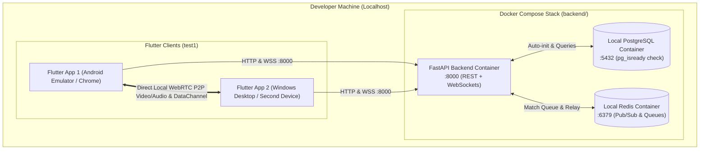

# Local Development, Services Setup & Testing Plan

This document details the step-by-step procedure to run and test the complete **Language Partner Matcher** system locally (**FastAPI + PostgreSQL + Redis + Flutter**) before deploying to AWS.

---

## 1. Local Architecture Overview



---

## 2. Included Local Services

The `docker-compose.yml` in `/backend` provisions all required services automatically:

| Service | Container Name | Image / Tech | Port | Role & Readiness |
| :--- | :--- | :--- | :--- | :--- |
| **FastAPI Backend** | `langmatcher_backend` | Python 3.11 + Uvicorn | `8000` | REST API + WebSocket Signaling. Auto-reloads code on file save. |
| **PostgreSQL Database** | `langmatcher_postgres` | `postgres:15-alpine` | `5432` | Local relational storage. Health check verified via `pg_isready`. |
| **Redis Cache** | `langmatcher_redis` | `redis:7-alpine` | `6379` | In-memory matchmaking queue & multi-instance Pub/Sub simulation. |

---

## 3. Step-by-Step Local Implementation & Run Plan

### Phase 1: Launch Backend Stack with Docker
1. Navigate to the `backend/` folder:
   ```bash
   cd backend
   ```
2. Start the containers in the background:
   ```bash
   docker-compose up --build -d
   ```
3. Verify running containers:
   ```bash
   docker ps
   ```
4. **Verification Endpoints:**
   * Health Check: `http://localhost:8000/api/v1/health` (Returns `{"status": "healthy"}`)
   * Swagger Documentation: `http://localhost:8000/docs`
   * Seeded Languages: `http://localhost:8000/api/v1/languages`

---

### Phase 2: Verify Database Schema & Auto-Seeding
On initial startup, FastAPI's `lifespan` automatically executes table creation and seeds default data:
* **Tables Created:** `users`, `languages`, `timezones`, `user_availability`, `call_sessions`.
* **Languages Seeded:** English (EN), Spanish (ES), French (FR), German (DE), Japanese (JA), Mandarin (ZH), Hindi (HI).
* **Timezones Seeded:** UTC, IST, EST, PST, JST.

---

### Phase 3: Launch and Test Flutter Client (`test1`)
1. Open a new terminal in the `test1/` folder:
   ```bash
   cd test1
   ```
2. **Run on Android Emulator:**
   ```bash
   flutter run -d emulator
   ```
   *(Note: Android Emulator communicates with host machine via `http://10.0.2.2:8000`)*
3. **Run on Chrome (Web):**
   ```bash
   flutter run -d chrome
   ```
4. **Run on Windows Desktop:**
   ```bash
   flutter run -d windows
   ```

---

### Phase 4: Dual-Client Peer-to-Peer (P2P) Testing
1. Launch Client A on Android Emulator and Client B on Chrome/Windows.
2. In Client A: Select Native: English, Target: Spanish. Click **Start Matchmaking**.
3. In Client B: Select Native: Spanish, Target: English. Click **Start Matchmaking**.
4. Both clients receive `match_found` from the FastAPI WebSocket signaling server.
5. Both clients join the WebRTC video room and establish direct P2P video, audio, and in-call DataChannel text chat.

---

## 4. Troubleshooting & Helpful Commands

* **View live backend logs:**
  ```bash
  docker-compose logs -f fastapi_backend
  ```
* **Restart backend services:**
  ```bash
  docker-compose restart
  ```
* **Stop and clear local database volume:**
  ```bash
  docker-compose down -v
  ```
