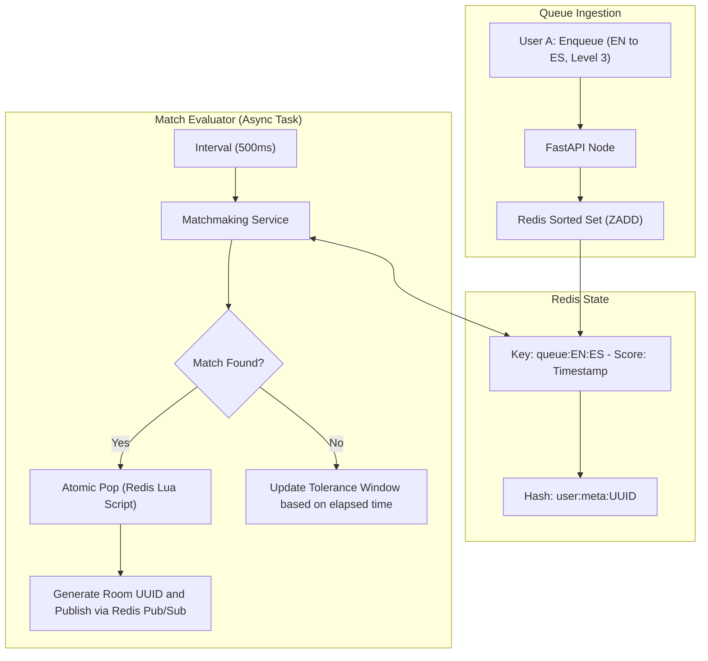

# Matchmaking Algorithm & Queue Architecture

This document describes the mathematical formulation, queue data structures, and dynamic tolerance expansion rules used in the **Language Partner Matcher**.

---

## 1. Matchmaking Requirements & Constraints

To create a balanced and productive conversational exchange, candidate pairs must satisfy three core conditions:

### 1.1 Reciprocal Language Match
A pair is mutually compatible if User A speaks what User B wants to learn, and User B speaks what User A wants to learn:
```text
User_A.native_language == User_B.target_language
AND
User_B.native_language == User_A.target_language
```

### 1.2 Proficiency Level Proximity
Learners with similar target language proficiency have more productive conversations:
```text
|User_A.proficiency_level - User_B.proficiency_level| <= Tolerance(t)
```
Where `Tolerance(t)` is a dynamic window that expands as waiting time `t` increases.

### 1.3 Timezone & Availability Overlap
Both users must have overlapping active practice windows, calculated by a bitwise AND of normalized 24-hour UTC bitmasks:
```text
(User_A.availability_bitmask & User_B.availability_bitmask) != 0
```

---

## 2. Dynamic Time-Decay Tolerance Expansion

To prevent long wait times during off-peak hours, the proficiency compatibility threshold relaxes over elapsed waiting time `t` (in seconds):

| Time in Queue (`t`) | Permitted Proficiency Delta (`Tolerance`) | Match Behavior |
| :--- | :--- | :--- |
| **0 s to 9 s** | `0` | Strict exact proficiency match (e.g., Level 3 with Level 3) |
| **10 s to 24 s** | `±1` | Close match (e.g., Level 3 with Level 2 or 4) |
| **25 s to 44 s** | `±2` | Moderate match (e.g., Level 3 with Level 1 or 5) |
| **>= 45 s** | `Any` | Open match: pair with any available partner of the reciprocal language pair |

---

## 3. Redis Queue Architecture



---

## 4. Atomic Match Evaluation (Lua Script)

To prevent race conditions where multiple backend workers attempt to pair the same user simultaneously, atomic matching and queue removal are executed via a Redis Lua script:

```lua
-- Redis Lua Script: match_and_pop.lua
-- KEYS[1]: queue_a_to_b, KEYS[2]: queue_b_to_a
-- ARGV[1]: user_id, ARGV[2]: user_proficiency, ARGV[3]: tolerance

local candidate_ids = redis.call('ZRANGE', KEYS[2], 0, -1)
for i, peer_id in ipairs(candidate_ids) do
    if peer_id ~= ARGV[1] then
        local peer_prof = tonumber(redis.call('HGET', 'user:meta:' .. peer_id, 'proficiency'))
        local diff = math.abs(peer_prof - tonumber(ARGV[2]))
        if diff <= tonumber(ARGV[3]) then
            -- Atomic removal from active queues
            redis.call('ZREM', KEYS[1], ARGV[1])
            redis.call('ZREM', KEYS[2], peer_id)
            return peer_id
        end
    end
end
return nil
```
