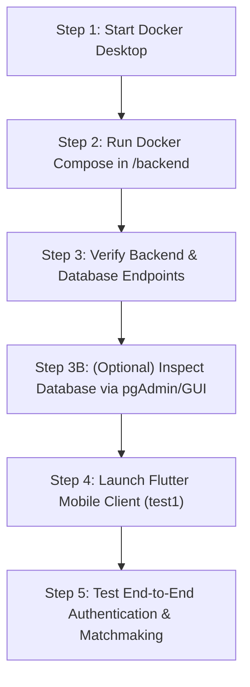

# Step-by-Step Local Setup & Execution Guide

This document is your complete, step-by-step developer guide to set up, run, and verify the backend, local database, Redis cache, and Flutter client on your machine.

---

## 1. Prerequisites & Required Tools Checklist

Before starting, ensure you have the following installed on your system:

| Tool | Recommended Version | Purpose | Is It Required? | Verification Command |
| :--- | :--- | :--- | :--- | :--- |
| **Docker Desktop** | Latest (v24+) | Runs PostgreSQL, Redis, and FastAPI in isolated containers. | **Required** | `docker --version` |
| **PostgreSQL 15** | 15 (Docker Image) | Core Relational Database storing users, languages, and history. | **Required** (Handled automatically by Docker) | `docker ps` |
| **Redis 7** | 7 (Docker Image) | In-memory queue for matchmaking and pub/sub. | **Required** (Handled automatically by Docker) | `docker ps` |
| **Flutter SDK** | v3.24+ | Builds and runs the mobile, web, and desktop frontend. | **Required** | `flutter doctor` |
| **pgAdmin / DBeaver** | Any | Visual GUI to view tables & rows (Optional database inspector). | **Optional** | Open app / browser |
| **Python** | 3.11+ | For running backend outside Docker if desired. | **Optional** | `python --version` |

> [!NOTE]
> **PostgreSQL vs pgAdmin:**
> - **PostgreSQL** is the database engine that actually stores your app data. It runs automatically in Docker.
> - **pgAdmin** is purely an optional graphical dashboard to view tables. You do not need pgAdmin for the app to run.

---

## 2. Step-by-Step Setup & Execution



---

### Step 1: Start Docker Desktop
1. Open **Docker Desktop** on Windows and ensure the Docker Engine is running (green indicator in bottom-left corner).

---

### Step 2: Launch the Backend & Database Stack
1. Open a terminal in the project root and navigate to the `backend/` directory:
   ```bash
   cd c:\V33R\Programming\College\Sem_7\Project\test1.0\backend
   ```
2. Start all services using Docker Compose:
   ```bash
   docker-compose up --build
   ```
   *(To run in the background, use `docker-compose up --build -d`)*

3. **What happens automatically:**
   - Starts **PostgreSQL 15** on `localhost:5432` with persistent data storage (`postgres_data`).
   - Starts **Redis 7** on `localhost:6379` for matchmaking queues & Pub/Sub (`redis_data`).
   - Starts **FastAPI** on `http://localhost:8000`.
   - On startup, FastAPI executes `init_db()` to automatically create all database tables (`users`, `languages`, `user_languages`, `call_history`) and seed default languages and timezones.

---

### Step 3: Verify the Backend & Database are Running

Open your browser and test the following URLs:

1. **API Health Check:**
   - URL: [http://localhost:8000/api/v1/health](http://localhost:8000/api/v1/health)
   - Expected Output: `{"status":"healthy","database":"connected","redis":"connected"}`
2. **Interactive Swagger Documentation:**
   - URL: [http://localhost:8000/docs](http://localhost:8000/docs)
   - Test `GET /api/v1/languages` $\to$ Should return English, Spanish, French, German, Japanese, Hindi, etc.

---

### Step 3B: (Optional) View Database Tables via pgAdmin / DBeaver / VS Code

If you want a graphical interface to see the database tables and data:

1. **Connect any SQL client (pgAdmin 4, DBeaver, or VS Code Database Extension):**
   - **Host:** `localhost` (or `127.0.0.1`)
   - **Port:** `5432`
   - **Database:** `langmatcher`
   - **Username:** `postgres`
   - **Password:** `postgres`
2. You will see the auto-created tables: `users`, `languages`, `user_languages`, and `call_history`.

---

### Step 4: Run the Flutter Client (`test1`)

Open a **second terminal** and navigate to `test1/`:
```bash
cd c:\V33R\Programming\College\Sem_7\Project\test1.0\test1
```

Choose your target device/platform to launch:

#### Option A: Run on Android Emulator (Recommended)
```bash
flutter run -d emulator
```
*(Note: Android emulators communicate with your local machine's `localhost` via IP `10.0.2.2:8000`)*

#### Option B: Run on Google Chrome (Web)
```bash
flutter run -d chrome
```

#### Option C: Run on Windows Desktop
```bash
flutter run -d windows
```

---

### Step 5: Test End-to-End User Flow

1. **Sign Up / Login:**
   - Navigate to Register in the app or use the Swagger UI (`http://localhost:8000/docs#/Auth/register_api_v1_auth_register_post`) to create a test user:
     ```json
     {
       "username": "alice",
       "email": "alice@example.com",
       "password": "password123",
       "native_language_id": 1,
       "target_language_id": 2,
       "proficiency_level": 3
     }
     ```
2. **Matchmaking Radar:**
   - In the Flutter app, click **Start Matchmaking** on the Practice tab.
   - The animated radar will activate and search for compatible learning partners in the Redis queue.
3. **P2P Video Call:**
   - Once matched, the app transitions to the **Video Call Screen** with Picture-in-Picture local camera preview, in-call chat, and audio controls.

---

## 3. Alternative: Running Backend Locally Without Docker (Python venv)

If you prefer to run Python directly on your host machine without Docker:

1. **Create and activate a virtual environment:**
   ```bash
   cd backend
   python -m venv venv
   .\venv\Scripts\activate
   ```
2. **Install dependencies:**
   ```bash
   pip install -r requirements.txt
   ```
3. **Start local PostgreSQL & Redis** (or run just the DBs via Docker: `docker-compose up postgres_db redis_cache -d`).
4. **Run FastAPI with auto-reload:**
   ```bash
   uvicorn app.main:app --host 0.0.0.0 --port 8000 --reload
   ```

---

## 4. Useful Management Commands

| Task | Command |
| :--- | :--- |
| **View live backend logs** | `docker-compose logs -f fastapi_backend` |
| **Stop all containers** | `docker-compose down` |
| **Reset and wipe local database** | `docker-compose down -v` |
| **Run Flutter unit/widget tests** | `flutter test` (in `test1/`) |
| **Analyze Flutter code** | `dart analyze lib` (in `test1/`) |
